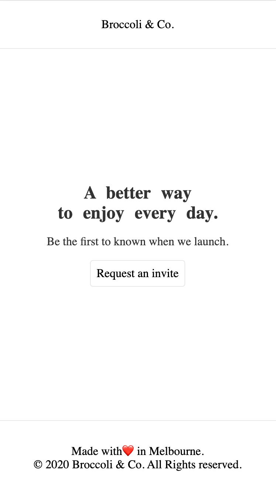
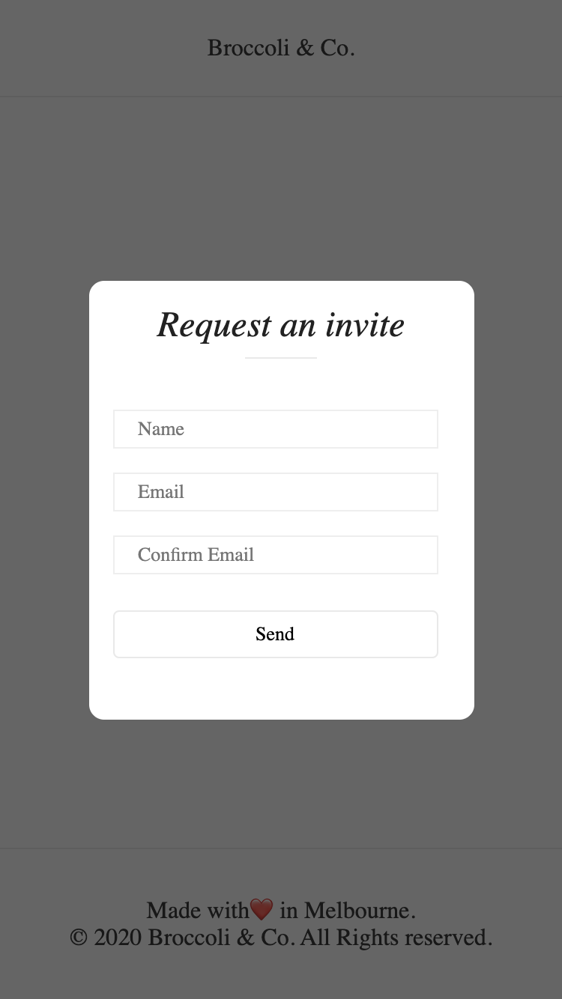
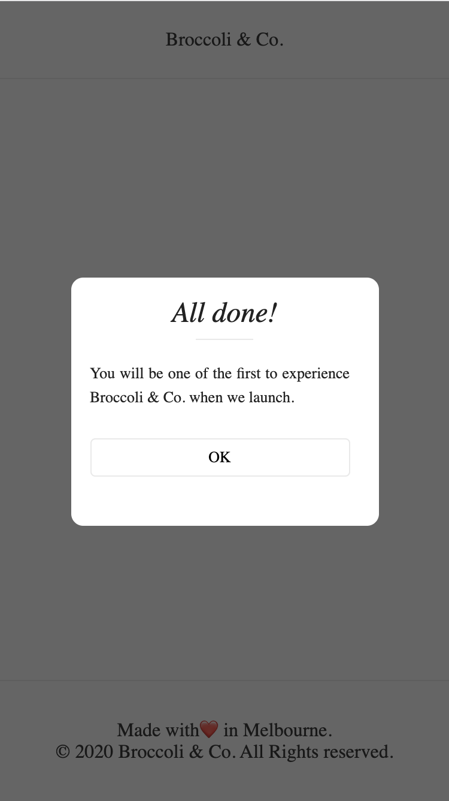

# invitation-demo

Invitation demo page, built with TypeScript and React.

Screen shot demo:





<div style="line-break: break"></div>

##### Prerun requirements

It needs `node` `>=v10` and `yarn` installed.


##### Development
```bash
yarn start // it will auto open browser tab to http://127.0.0.1:3000
```

##### Build
```bash
yarn build
```

##### Bundle Profile
```bash
yarn profile
```
